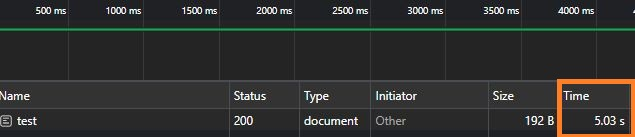
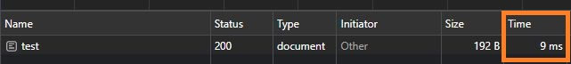

# Cache (Önbellek)

## Cache Nedir ?

Cache, bilgisayarlarda kullanılan bir bellek türüdür. Amacı önemli verileri daha hızlı erişebilmek ve sistem performansını arttırabilmekdir.

İşlemciler çalışma prensşbleri gereği işlem yaparken sürekli ram veya hdd'de tutulan verilere erişmek zorundadır. Bu geçici depolama birimleri işlemciye göre yavaş çalıştıklarınan dolayı işlemcinin veriye erişmesi için beklemesi gereken zamanı arttırmaktadır.

Bu tür gecikmeleri azaltmak ve işlemcinin daha hızlı çalışmasını sağlamak için cache kullanılır. Bu sayede sık kullanılan verilere daha hızlı erişilebilir ve gecikmeler azaltılır.

## Cache Nerelerde Kullanılır

Cache, web sayfaları, resimler, kodlar gibi veri türlerini depolayabilir.

Önbellek, web tarayıcılar, işletim sistemleri ve diğer yazılımlar tarafından kullanılır. Web tarayıcılar, ziyaret ettiğiniz web sayfalarının içeriğini önbelleğe alır. Böylece, bir web sayfasını tekrar ziyaret ettiğinizde, tarayıcı sayfayı önbellekten yükler ve internetten yüklemesine gerek kalmaz. Bu yöntem web sayfalarının daha hızlı yüklenmesini sağlar.

## Redis (Remote Dictionary Server)

Redis, hızlı NoSql bir veritabanıdır. Veryiyi bellekte tuttuğu için çok hızlı okuma ve yazma yapılır. Redis 5 farklı veri yapısı seçeneği sunar. Bunlar **STRING, LIST, SET, HASH, ZSET**'dir.

### Redis Kullanım Alanları

- **Önbellek**: Redis, veritabanlarından gelen verileri önbelleğe alarak veritabanlarına yapılan istek sayısını azaltarak performansı artırabilir. Örnek olarak çok karmaşık bir sorgumuz var ise bu sorguyu bir kere çalıştırıp sorgu sonucunu cache'e atarız ve o sorgunun sonucu istendiği zaman verileri direkt olarak veritabanı yerine cache'den çekeriz.
- **Oturum yönetimi**: Redis, oturum verilerini depolayarak oturum verilerinin kaybolmasını önlemeye yardımcı olabilir.
- **İletişim/Mesajlaşma**: Redis, uygulamaların birbirleriyle gerçek zamanlı olarak iletişim kurmasına olanak tanır.
- **Ölçümleme**: Redis, uygulama performansını iyileştirmek için yardımcı olabilir.
- **Oyun geliştirme**: Redis, oyunların gerçek zamanlı olarak etkileşime girmesine olanak tanır.
- **Büyük veri analizi**: Redis, büyük miktarda veriyi depolamak ve işlemek için yardımcı olabilir.

### Redis Kurulumu

Redisi bilgisayarımıza docker hub üzerinden kuracağız.

- Redis'in docker image dosyasını indirmek için aşağıdaki komutu çalıştırmak yeterlidir.

```command
docker pull redis
```

- Redisi çalıştırmak için aşağıdaki komutu çalıştırmalıyız. (Komutu çalıştırırken -p ile hangş port üzerinde çalışması gerektiğini belirtmeliyiz aksi halde redise erişemeyiz.)

```command
docker run -p 6379:6379 --name redisserver -d redis
```

### Anotasyonlar

| Anotasyon    | Tanım                                                   |
|--------------|---------------------------------------------------------|
| **@EnableCaching**  | Spring cache özelliğini aktif etmek için kullanılır.|
| **@CachePut**   |Cache güncellemek için kullanılır.|
| **@CacheEvict** |Cache silmek için kullanılır.   |

## Cache İşleminden Önce



## Cache İşleminden Sonra


